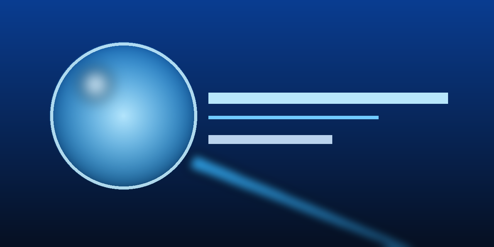

# ReverseRay



ReverseRay превращает Android-устройство в выходной узел персонального прокси.
Сервер, запущенный в Docker, предоставляет стандартный SOCKS5/HTTP-инбокс, но весь
трафик физически покидает сеть через телефон: устройство само устанавливает
исходящий TLS-туннель к серверу, поэтому входящие соединения и проброс портов
не требуются — схема работает из любой мобильной или Wi-Fi сети, включая NAT и CGNAT.

```
[Приложения] → [Xray outbound: socks5] → [Docker: reverseray]
                                              │  TLS 1.3 туннель RRP/1
                                              │  (телефон инициирует соединение сам)
                                              ▼
                                        [Android APK] → [Интернет]
```

Сервер не инициирует соединений в интернет: он только запрашивает у телефона
подключение к целевому хосту. DNS разрешается на стороне телефона.

## Возможности

- **Протокол RRP/1** — мультиплексированные потоки поверх TLS 1.3, flow-control
  на поток и туннель, лимиты размера кадров, keep-alive с джиттером.
- **Сервер** (Go, без внешних зависимостей): mixed-инбокс SOCKS5/HTTP на одном
  порту, HMAC-токены с одноразовым nonce, admin API на localhost/unix-сокете,
  метрики Prometheus, структурированные логи с редактированием хостов.
- **Клиент** (Kotlin, minSdk 14, targetSdk 36): foreground-сервис, пул туннелей,
  reconnect с экспоненциальной задержкой, мгновенный retry при смене сети,
  импорт конфигурации по QR-коду.
- **Безопасность**: TLS 1.3 + SPKI-pinning на CA (ротация leaf-сертификата без
  обновления клиентов), токены хранятся только как SHA-256, защита от SSRF на
  уровне байтов резолвнутых адресов, ограничение handshake по IP.

## Состав

| Компонент | Стек | Состояние |
|---|---|---|
| `server/` | Go, ноль внешних зависимостей | стабилен: mixed-инбокс, RRP/1, TLS, admin, метрики |
| `android/` | Kotlin, BouncyCastle TLS | рабочий клиент: туннель, QR, сервис |
| `docs/protocol.md` | спецификация RRP/1 | актуальна |
| `landing/` | одностраничный сайт | опубликован на GitHub Pages |

## Быстрый старт

### 1. Сервер

```bash
mkdir -p state && chown 65532:65532 state
docker compose up -d

# выпуск токена устройства и печать CA-pin:
docker compose exec reverseray /reverseray enroll -state-dir /var/lib/reverseray \
  -name phone-1 -host YOUR_SERVER_IP -port 443
```

### 2. Устройство

Установите APK со страницы [Releases](https://github.com/stelgen/reverseray/releases)
и введите конфигурационную строку из `enroll` либо отсканируйте её QR-код:

```
rrp://<token>@YOUR_SERVER_IP:443/?pin=<CA_PIN>&name=phone-1
```

### 3. Проверка

```bash
curl --proxy socks5h://127.0.0.1:1080 https://ifconfig.me
# в ответе — IP устройства, а не сервера
```

### Интеграция с Xray

```json
{
  "protocol": "socks",
  "settings": { "servers": [{ "address": "SERVER_IP", "port": 1080 }] }
}
```

## Безопасность

Кратко: TLS 1.3 с обязательным ALPN и SPKI-пином на CA; токены — только в виде
SHA-256, аутентификация HMAC с одноразовым nonce; лимиты кадров по типам
(DATA ≤ 64 КБ, управляющие ≤ 4 КБ) и бюджет памяти на устройство; rate-limit
handshake и блокировка по IP; admin API на localhost/unix-сокете; контейнер —
distroless, non-root, read-only rootfs, `cap_drop ALL`.

Полная модель угроз и политики раскрытия — в [SECURITY.md](SECURITY.md),
спецификация протокола — в [docs/protocol.md](docs/protocol.md).

## Эксплуатация

- Обновления контейнера выполняются вручную по digest-пину из `deploy/digests.yaml`
  (автообновление не используется).
- Перед обновлением делается резервная копия каталога `state/` (токены, CA).
- Откат — на предыдущий digest из той же таблицы.

## Сборка из исходников

Сервер:

```bash
cd server && go test -race ./... && go build -o reverseray .
```

Клиент (JDK 17, Android SDK 36):

```bash
cd android && ./gradlew :app:assembleRelease
```

Подпись релиза берётся из переменных окружения `RR_KEYSTORE`,
`RR_KEYSTORE_PASSWORD`, `RR_KEY_ALIAS`, `RR_KEY_PASSWORD`.

## CI/CD

- `ci.yml` — gofmt, vet, `go test -race`, покрытие, smoke-сборка образа,
  сборка Android-приложения и unit-тесты (Robolectric, API 21/31).
- `release.yml` (тег `v*`) — бинарники amd64/arm64/armv7 + SHA256SUMS,
  multi-arch образ в `ghcr.io/stelgen/reverseray`, APK — в GitHub Releases.

## Совместимость

- Android 4.0 (API 14) — Android 16 (API 36); автоматизированные тесты
  выполняются на API 21 и 31, для API 14–20 предусмотрен ручной smoke-чеклист.
- Протокол RRP/1 согласуется через `HELLO.caps`, обратная совместимость
  сохраняется в рамках мажорной версии протокола.

## Лицензия

MIT — см. [LICENSE](LICENSE).
