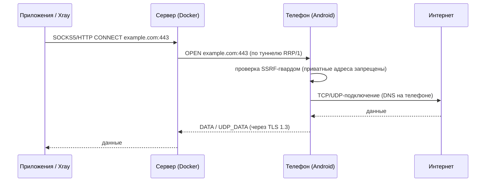

# ReverseRay

<p align="center">
  
</p>

<p align="center">
  <a href="https://github.com/stelgen/reverseray/releases"></a>
  <a href="https://github.com/stelgen/reverseray/actions/workflows/ci.yml"></a>
  <a href="LICENSE"></a>
  
  
  
  
  
  <a href="https://github.com/stelgen/reverseray/pulls"></a>
  <a href="https://github.com/stelgen/reverseray/stargazers"></a>
</p>

<p align="center"><b>
  Личный прокси, исходящий трафик которого идёт через ваше Android-устройство.
  Сервер выглядит как обычный SOCKS5/HTTP-прокси, но «выход в интернет» —
  ваш телефон: резидентный IP, NAT/CGNAT не мешают, VPS-провайдер не нужен.
</b></p>

---

## 🇷🇺 Русский

### Что это и зачем

Типовой сценарий: у вас есть сервер в облаке, но нужен **резидентный IP** —
адрес домашней или мобильной сети (для сервисов, отслеживающих датацентровые
адреса). ReverseRay решает это разворотом ролей: сервер принимает подключения,
а интернет-трафик проходит через ваш телефон, который **сам** инициирует
TLS-туннель к серверу. Входящие порты на телефоне не нужны, работает из любой
сети — Wi-Fi, LTE, за CGNAT.


```mermaid
sequenceDiagram
    participant A as Приложения / Xray
    participant S as Сервер (Docker)
    participant P as Телефон (Android)
    participant N as Интернет

    A->>S: SOCKS5/HTTP CONNECT example.com:443
    S->>P: OPEN example.com:443 (по туннелю RRP/1)
    P->>P: проверка SSRF-гвардом (приватные адреса запрещены)
    P->>N: TCP/UDP-подключение (DNS на телефоне)
    N-->>P: данные
    P-->>S: DATA / UDP_DATA (через TLS 1.3)
    S-->>A: данные
```

### Возможности

- **Протокол RRP/1**: мультиплексирование потоков, flow-control, лимиты кадров,
  keep-alive. Спецификация: [`docs/protocol.md`](docs/protocol.md).
- **Мульти-протокол с согласованием (v0.7.4)**: реестр протоколов и на сервере,
  и в APK; сервер всегда принимает все свои протоколы, обменивается списком в
  рукопожатии (`proto`/`protocols`), мусорное значение сводится к дефолту без
  ошибки. Дефолт — самый стабильный `rrp1` (задаётся `RR_PROTOCOL`/compose).
- **Смена протокола с валидацией (v0.7.4)**: APK переключается на протокол из
  списка сервера только после PROBE — реального egress до реального хоста
  (`1.1.1.1:443` по умолчанию). Не прошло — 3 ретрая и мгновенный откат UI на
  рабочий протокол, ссылка не портится, cooldown 60 с от rate-limit циклов.
- **Бронепарсер ссылок (v0.7.4)**: rrp:// строка с кавычками любого вида,
  невидимыми ASCII/Unicode-символами, текстом вокруг и хвостовыми точками
  чинится автоматически — и в поле ввода, и в QR, и в импорте из файла.
- **TCP и UDP через туннель**: SOCKS5 CONNECT + UDP ASSOCIATE — DNS+,
  QUIC/HTTP3 и игры идут через телефон.
- **WebSocket-транспорт** (`transport=ws`): туннель по пути `/rrp` того же
  TLS-порта — обход DPI-ограничений портов (443/80/CDN).
- **TOFU-доверие самоподписанным сертификатам**: сервер перегенерировал CA —
  туннель оживает без re-enroll (новый пин печатается в журнал). Строгий
  режим пина сохранён.
- **Автопилот деплоя `deploy/rr.sh`**: одна команда из любого каталога —
  ставит/обновляет/чинит и печатает готовую строку подключения.
- **Приложение** (Kotlin, Android 4.0+): 4 вкладки — Главная (круглая
  «Старт/Стоп», окно трафика: скорость, счётчики пакетов «стрелками»,
  тип/размер последнего пакета, внешний и локальный IP, страна/оператор,
  терминальный лог), Связь (ссылка/QR/файлы/протоколы), Обновление
  (авто-проверка раз в 24 ч, тех-лог), Настройки (панель «О телефоне»,
  лимит трафика, только-Wi-Fi).
- **Лимит трафика (v0.7.4)**: по умолчанию без ограничений; суточный/месячный
  с днём сброса; превышение останавливает туннель; счётчик переживает рестарт.
- **Веб-морда сервера `/ui` (v0.7.4)**: сессии, протоколы, RTT, трафик и
  egress IP в браузере (`http://IP:9090/ui`); rr.sh печатает LAN-URL.
- **Сервер** (Go, ноль зависимостей): mixed-инбокс SOCKS5/HTTP (TCP+UDP) на
  одном порту, TLS 1.3, HMAC-токены с одноразовым nonce, admin API, метрики
  Prometheus, авто-подхват токенов, самовосстановление state при проблемах
  с правами.
- **Безопасность**: anti-SSRF на байтах резолвнутых адресов (включая
  TEST-NET), lockout при брутфорсе токена, rate-limit рукопожатий,
  адреса назначения в логах не пишутся.

<p align="center">
  
</p>

### Быстрый старт — одна команда (автопилот)

Из ЛЮБОГО каталога, где стоит терминал: скрипт создаёт подпапку `reverseray/`
(compose, state, .env), сам скачивает образ, ставит/обновляет, проверяет
здоровье и **печатает готовую строку подключения**:

```bash
curl -fsSL https://raw.githubusercontent.com/stelgen/reverseray/main/deploy/rr.sh -o rr.sh
sudo bash rr.sh
```

Вывод:

```
==============================================================
 ГОТОВО. Строка подключения (вставь в приложение / QR):
 rrp://<token>@81.25.59.194:4433/?pin=<CA_PIN>&name=phone-1&proto=rrp1

 ВЕБ-МОРДА (сессии, трафик, IP, протоколы):
   http://<LAN_IP>:9090/ui  ← открой в браузере любого устройства LAN
==============================================================
```

Что делает скрипт: свежая установка или обновление (решает сам), healthcheck,
идемпотентный enroll (токен не меняется при повторных запусках).

Флаги:

| Команда | Действие |
|---|---|
| `sudo bash rr.sh` | установить / обновить до последнего релиза |
| `sudo bash rr.sh --tag v0.7.4` | конкретная версия |
| `sudo bash rr.sh --no-ui` | не открывать веб-морду в LAN (только localhost) |
| `sudo bash rr.sh --reset` | обнулить состояние (токены/CA) и пере-enroll |

Автообновления контейнера **запрещены** — обновление только этой командой
или вручную.

### Телефон

1. Скачайте `reverseray-<версия>.apk` со страницы
   [Releases](https://github.com/stelgen/reverseray/releases) — или обновите
   прямо из приложения (вкладка «Обновление»; авто-проверка раз в 24 ч,
   окно можно закрыть).
2. Вкладка «Связь»: вставьте строку подключения (или отсканируйте QR) —
   парсер сам почистит кавычки/невидимые символы/текст вокруг; кнопка
   «Проверить и починить» покажет канонический вид.
3. Вкладка «Главная»: большая круглая кнопка «Старт» — туннель готов: 🟢,
   график трафика и счётчики пакетов пошли. После первого подключения на
   вкладке «Связь» появляется список протоколов сервера — смена с валидацией
   реальным трафиком и мгновенным откатом при неудаче.

Проверка прокси:

```bash
curl --proxy socks5h://127.0.0.1:1080 https://ifconfig.me
# ответ — IP телефона
```

### Если не подключается

1. В приложении кнопка «Журнал» — последовательность ошибок, копируется/шарится.
2. Порт **4433/tcp** и **1080/udp** должны быть открыты в файрволе облака.
3. После перегенерации CA на сервере туннель поднимется сам (TOFU); новый
   `pin` появится в журнале приложения — можно обновить строку конфига.
4. Сервер «не здоров»? `sudo bash rr.sh --reset` — чистое состояние и новая
   строка подключения за минуту.
5. Статус в приложении: 🟡 подключается · 🟢 подключено · 🔴 ошибка.

### Интеграция с Xray

```json
{
  "protocol": "socks",
  "settings": { "servers": [{ "address": "SERVER_IP", "port": 1080 }] }
}
```

### Безопасность

Кратко: TLS 1.3 с ALPN и SPKI-пином на CA (+ TOFU для самоподписанных);
токены хранятся только как SHA-256; аутентификация — HMAC с одноразовым
nonce; лимиты кадров (DATA/UDP ≤ 64 КБ, управление ≤ 4 КБ) и бюджет памяти на
устройство; admin API — только localhost/unix-сокет; контейнер — distroless,
read-only rootfs, `cap_drop: ALL`, no-new-privileges (по умолчанию работает
под root **без единой capability** — иначе nonroot не может писать в
root-owned bind-mount state). Полная модель угроз —
[`SECURITY.md`](SECURITY.md), отчёт аудита —
[`docs/security-audit-2026-09.md`](docs/security-audit-2026-09.md).


```mermaid
flowchart LR
    subgraph Trust zones
        W[Интернет] -- TLS 1.3 + SPKI-pin --> S
        S -- "RRP/1 (внутри TLS)" --> P
        P -- "TCP/UDP (SSRF-guard)" --> N[Сеть телефона]
    end
    S[Сервер<br/>0 исходящих]:::server
    P[Телефон<br/>egress]:::phone
    classDef server fill:#0b2545,stroke:#35B6FF
    classDef phone fill:#0b3d2e,stroke:#2E7D32
```

### Архитектура

```
server/                    Go-сервер: инбоксы (SOCKS5/HTTP, TCP+UDP), RRP/1, WS, hub, метрики, TLS-PKI
android/                   Kotlin-клиент: туннель (TCP/WS), M3-интерфейс, updater
docs/protocol.md           Спецификация RRP/1 (включая UDP_ASSOC/UDP_DATA и WS)
docs/security-audit-…      Отчёт аудита безопасности
deploy/rr.sh               Автопилот деплоя/обновления (относительная папка ./reverseray)
deploy/digests.yaml        Digest-пины образов для прод-компоуза
assets/brand/              Брендинг (генератор + тесты); app-icon.png — ассет иконки из APK
```

---

## 🇬🇧 English

**ReverseRay** turns an Android device into the egress node of a personal
proxy. The server (Docker) exposes a standard SOCKS5/HTTP inbound, but all
traffic physically exits through your phone: the device **initiates** the
TLS 1.3 tunnel itself, so no inbound ports or port forwarding are required.
It works behind NAT/CGNAT and yields a residential IP instead of a datacenter one.

### Quick start (one command — autopilot)

From ANY directory: the script creates a `reverseray/` subfolder (compose,
state, .env), pulls the image, deploys/updates, checks health and **prints
the ready-to-use connection string**:

```bash
curl -fsSL https://raw.githubusercontent.com/stelgen/reverseray/main/deploy/rr.sh -o rr.sh
sudo bash rr.sh
```

Flags: `--tag vX.Y.Z` (specific version) · `--reset` (wipe tokens/CA and
re-enroll). Re-running it checks and updates to the latest release
(container auto-updates are forbidden — updates happen only via this script
or manually).

### Phone

1. Grab `reverseray-<version>.apk` from
   [Releases](https://github.com/stelgen/reverseray/releases) — or update
   in-app («Check for updates»).
2. Paste the connection string (or scan its QR).
3. Tap the big round «Start» button — tunnel is up (green status, live
   traffic graph, your IP/country/ISP shown).

Verify:

```bash
curl --proxy socks5h://127.0.0.1:1080 https://ifconfig.me
# returns the phone's IP
```

### Highlights

- **RRP/1** multiplexed protocol over TLS 1.3 with SPKI CA pinning
  ([`docs/protocol.md`](docs/protocol.md))
- **TCP + UDP** through the tunnel (SOCKS5 CONNECT + UDP ASSOCIATE: DNS+,
  QUIC/HTTP3, games)
- **WebSocket transport** (`transport=ws`) on the same TLS port — DPI-friendly
- **TOFU** trust for regenerated self-signed CAs — tunnel survives server
  CA rotation without re-enroll
- Go server with **zero dependencies**; Android client (API 14+)
- Hostile-environment test suites for both sides (`evilclient_test.go`,
  `EvilServerTest.kt`)

### Compatibility

| Component | Min | Tested |
|---|---|---|
| Server | Linux, Go 1.24+ | amd64 / arm64 / armv7 |
| Client | Android 4.0 (API 14) | Robolectric 21/31, manual smoke 14–20 |

---

<p align="center">
  <a href="SECURITY.md">Security</a> ·
  <a href="docs/protocol.md">Protocol</a> ·
  <a href="CHANGELOG.md">Changelog</a> ·
  <a href="https://stelgen.github.io/reverseray/">Landing</a>
</p>

## Лицензия и авторство

**BSD 2-Clause** — см. [LICENSE](LICENSE). Владелец авторских прав —
STELGEN, автор идеи и проекта: https://github.com/stelgen/reverseray.

Лицензия **обязывает сохранять указание авторства** в любом редистрибутиве
(копирайт-строка и LICENSE-файл): форки, статьи и сборки должны ссылаться на
автора. Документация/брендинг по желанию — на условиях CC-BY-4.0.
