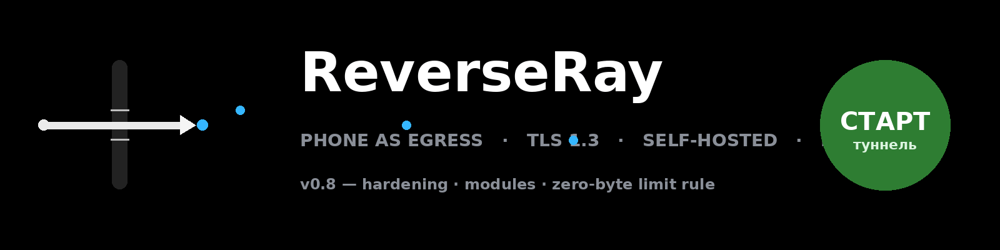

# ReverseRay

<p align="center">
  
</p>

<p align="center">
  <a href="https://github.com/stelgen/reverseray/releases"></a>
  <a href="https://github.com/stelgen/reverseray/actions/workflows/ci.yml"></a>
  <a href="LICENSE"></a>
  
  
  
  
  
  
  <a href="https://github.com/stelgen/reverseray/pulls"></a>
  <a href="https://github.com/stelgen/reverseray/stargazers"></a>
</p>

<p align="center"><b>
  Личный прокси, исходящий трафик которого идёт через ваше Android-устройство.
  Сервер выглядит как обычный SOCKS5/HTTP-прокси, но «выход в интернет» —
  ваш телефон: резидентный IP, NAT/CGNAT не мешают, VPS-провайдер не нужен.
  v0.8: WAN-hardening (анти-скан), модульная система APK↔сервер, MTProto/2,
  лимит трафика «король», дисциплина SSD/RAM.
</b></p>

<p align="center">
  
</p>
<p align="center"><sub>Скриншот — РЕАЛЬНЫЙ рендер APK: его делает CI-робот через ScreenshotTest,
никаких «картинок в Paint».</sub></p>

---

## 🇷🇺 Русский

### Что это и зачем

Типовой сценарий: у вас есть сервер в облаке, но нужен **резидентный IP** —
адрес домашней или мобильной сети. ReverseRay разворачивает роли: сервер
принимает подключения, а интернет-трафик проходит через ваш телефон,
который **сам** инициирует TLS-туннель. Входящие порты на телефоне не нужны,
работает из любой сети — Wi-Fi, LTE, за CGNAT.

```mermaid
sequenceDiagram
    participant A as Приложения / Xray
    participant S as Сервер (Docker)
    participant P as Телефон (Android)
    participant N as Интернет

    A->>S: SOCKS5/HTTP CONNECT example.com:443
    S->>P: OPEN example.com:443 (по туннелю RRP/1)
    P->>P: SSRF-гвард по байтам резолвнутых адресов
    P->>N: TCP/UDP (DNS на телефоне)
    N-->>P: данные
    P-->>S: DATA / UDP_DATA (TLS 1.3; mtproto2 — в MTProto-конверте)
    S-->>A: данные
```

### Возможности (v0.8)

- **RRP/1**: мультиплексирование, flow-control, лимиты кадров, keep-alive —
  спецификация [`docs/protocol.md`](docs/protocol.md).
- **🛡 WAN-hardening (v0.8)**: туннельный порт отвечает ТОЛЬКО настоящим
  TLS-клиентам. Первый байт не TLS (`0x16`)? Это сканер (nmap -sV, пробники
  бинаря, masscan): tarpit-задержка + **тихое закрытие без единого байта
  ответа** — порт не палит ни версию, ни протокол. Плюс глобальный и
  per-IP лимиты параллельных соединений от автоматизированного скана.
  ICMP-пинги отвечает ядро хоста — рецепт iptables в [`SECURITY.md`](SECURITY.md).
- **🧩 Модульная система (v0.8)**: APK — тонкий движок (как ПО POS-терминала),
  сервер и приложение парсят **один и тот же** манифест
  [`modules/modules.json`](modules/modules.json) и оркестрируют его одинаково.
  Модули обновляются с GitHub без переустановки APK (и на телефоне, и на
  сервере — по версии/хешу, только при изменении, раз в сутки, мусорный
  манифест никогда не применяется). Новый протокол = строка в манифесте +
  код на обеих сторонах; клиенты договариваются в рукопожатии и **фоллбечатся**
  друг с другом.
- **🔐 Протокол mtproto2 (v0.8)**: после нашего приватного хендшейка
  (TLS 1.3 + SPKI-pin + HMAC-токен) ключи перегенерируются DH-обменом по
  канону MTProto 2.0 (официальный dh_prime Telegram, safe prime; валидация
  долей по Security Guidelines), а payload'ы DATA/UDP_DATA ходят в
  MTProto-конверте (AES-256-IGE, msg_key SHA-256). Управляющие кадры —
  как были. Кросс-языковой KAT-тест гарантирует, что Go и Kotlin говорят
  одинаково.
- **👑 Лимит трафика — король (v0.8)**: суточный/месячный с датой сброса.
  Исчерпан → **РОВНО НОЛЬ байт** от приложения: туннель и все соединения
  умирают, на главном экране — сообщение, при нажатии Старт/Реконнект —
  отдельное окно «Траффик закончился» с датой обновления лимита.
  Автоподключение (выкл по умолчанию) умеет ждать даты сброса.
- **Спидтест 5 секунд (v0.8)** после подключения — только если лимит
  не достигнут; результат в окне статуса главной.
- **Единое консольное окно (v0.8)**: тот же лог/формат на Главной, в
  Обновлении и на вкладке Лог: листается, кнопка «↧ live» внутри бара,
  положение сохраняется; строки: 🟢 туннель поднялся, 🔴 упал,
  🟡 тёмно-жёлтое важное, белое — информационная беготня.
  **Канон приватности: мы не прячем ничего** из того, что делаем с сетью
  и данными пользователя — всё в консоли и на вкладке «О сети».
- **Честные вкладки (v0.8)**: «О приложении» (версии, модули, RAM,
  диск APK+данные, трафик за всё время, протокол), «О устройстве»
  (CPU-модель, общая RAM, Android/SDK, Java), «О сети» — ВСЁ, что
  приложение узнало: DNS-серверы, **кто реально резолвит** (даже сквозь
  роутер), DNSSEC, DoT/DoH, ECS («мы не шлём»), шифрование SNI («не
  поддерживается уровнем ОС»).
- **Обновления без переустановки**: модули с GitHub (прогресс % и скорость
  в консоли обновления), сам APK — по кнопке или авто-проверкой раз в 24 ч.
- **Поделиться приложением (v0.8)**: ссылка на GitHub или APK «в сборе» —
  без единого байта настроек/токенов/логов: у нового пользователя всё в
  дефолтах.
- **💾 Дисциплина SSD/RAM (v0.8)**: счётчики живут в RAM и пишутся на диск
  раз в минуту; APK не изнашивает память телефона при работе 24/7 —
  канон, проверено тестами.
- **Docker**: distroless, read-only rootfs, `cap_drop: ALL`; healthcheck
  обязателен; **restart-governor** перезапускает упавший процесс не чаще
  раза в 30 с, а при реальном бесконечном crash-loop — отдаёт контейнер
  Docker с ошибкой (не молотит нагрузкой).
- **Веб-морда `/ui`**: сессии, трафик, egress IP, протоколы + hardening-
  счётчики и версия модулей.
- **Приложение**: Android 4.0+ (API 14) — политика совместимости канона
  (см. [`docs/WORKFLOW.md`](docs/WORKFLOW.md)); Material 3 тёмная тема.

<p align="center">
  
</p>

### Быстрый старт — одна команда (автопилот)

Из ЛЮБОГО каталога: скрипт создаёт подпапку `reverseray/` (compose, state,
.env), сам скачивает образ, ставит/обновляет, проверяет здоровье и печатает
готовую строку подключения:

```bash
curl -fsSL https://raw.githubusercontent.com/stelgen/reverseray/main/deploy/rr.sh -o rr.sh
sudo bash rr.sh
```

Флаги: `--tag v0.8.0` · `--reset` · `--no-ui`.

Автообновления контейнера **запрещены** — обновление только этой командой
или вручную.

### Телефон

1. Скачайте `reverseray-<версия>.apk` со страницы
   [Releases](https://github.com/stelgen/reverseray/releases) — или обновите
   в приложении (вкладка «Обновление»).
2. Вкладка «Связь»: вставьте строку подключения — приложение **само** её
   почистит, покажет зелёное «Ссылка сохранена ✓» и тост. Кнопка «Очистить»
   — с подтверждением.
3. Вкладка «Главная»: одна круглая кнопка «Старт». Статус, график, пакеты,
   IP/страна/оператор/DNS, спидтест — в карточке; единая консоль ниже.

Проверка прокси:

```bash
curl --proxy socks5h://127.0.0.1:1080 https://ifconfig.me
# ответ — IP телефона
```

### Если не подключается

1. Вкладка «Лог»: весь журнал, кнопки «Копировать весь лог» и «Поделиться».
2. Порт **4433/tcp** и **1080/udp** должны быть открыты в файрволе облака.
3. TOFU: после перегенерации CA туннель поднимется сам, новый pin — в журнале.
4. `sudo bash rr.sh --reset` — чистое состояние за минуту.
5. Сканеры в логах сервера видны как метрики `reverseray_hardening_*` —
   это нормально: порт молчит по дизайну.

### Интеграция с Xray

```json
{
  "protocol": "socks",
  "settings": { "servers": [{ "address": "SERVER_IP", "port": 1080 }] }
}
```

### Безопасность (v0.8)

Кратко: TLS 1.3 + ALPN + SPKI-pin (TOFU для самоподписанных); токены
только как SHA-256; HMAC с одноразовым nonce; anti-SSRF на байтах адресов;
**WAN-hardening: анти-скан с tarpit и нулём ответных байтов, лимиты
параллельности, security-заголовки и без-деталей 500-е**; mtproto2 —
канон MTProto 2.0 поверх приватного хендшейка; admin API — только
localhost/unix; контейнер distroless + governor. Полная модель угроз —
[`SECURITY.md`](SECURITY.md), свежий аудит —
[`docs/security-audit-2026-10.md`](docs/security-audit-2026-10.md).


```mermaid
flowchart TB
    subgraph WAN["Интернет / WAN"]
        SCAN["nmap · masscan · пробники"] -. "первый байт ≠ TLS:<br/>tarpit + тишина (0 байт)" .-> S
        A["Xray / приложения"] -- "SOCKS5/HTTP" --> S
    end
    subgraph TLS["Приватный хендшейк"]
        S[Сервер<br/>hardening gate] -- "TLS 1.3 + SPKI-pin + HMAC nonce" --> P
        P -- "proto=mtproto2:<br/>DH + MTProto 2.0 конверт" --> P
    end
    P[Телефон<br/>egress + лимит-король] -- "TCP/UDP (SSRF-guard)" --> N[Сеть телефона]
    subgraph MODS["Модули (общий манифест)"]
        M["modules.json<br/>GitHub → APK + сервер"]
    end
    M -. "реестр протоколов/политики" .-> S
    M -. "реестр протоколов/политики" .-> P
    classDef server fill:#0b2545,stroke:#35B6FF
    classDef phone fill:#0b3d2e,stroke:#2E7D32
    class S,SCAN server
    class P,MODS phone
```

### Архитектура

```
server/                    Go-сервер: инбоксы (SOCKS5/HTTP, TCP+UDP), RRP/1+WS, mtproto2,
                           hardening gate, modules syncer, hub, метрики, TLS-PKI
android/                   Kotlin-клиент: туннель (TCP/WS/mtproto2), модули, лимит-король,
                           единая консоль, честные вкладки
modules/                   ОБЩИЙ манифест модулей APK ↔ сервер (+ правила)
docs/protocol.md           Спецификация RRP/1 + UDP + WS + mtproto2 + модули
docs/security-audit-2026-10.md  Аудит безопасности v0.8 (buffer overflow/injection)
deploy/rr.sh               Автопилот деплоя/обновления
scripts/                   CI-роботы: modules_check, privacy_audit
assets/brand/              Брендинг + РЕАЛЬНЫЙ скриншот (CI-робот) + динамический banner.gif
```

### CI-роботы (v0.8)

| Робот | Что делает |
|---|---|
| `go` | gofmt/vet/test-race/coverage — 102 теста |
| `android` | сборка + 119 JVM-тестов (Robolectric 21/31, evil-сервер, KAT MTProto) |
| `modules` | канон-чек манифеста + парсеры обеих сторон согласны |
| `privacy-audit` | ни телеметрии, ни внешних хостов вне белого списка, ни приватных данных в доках |
| `govulncheck` | известные уязвимости stdlib/зависимостей |
| `gitleaks` | секреты |
| `screenshot` | РЕАЛЬНЫЙ рендер APK → `assets/brand/screenshot.png` (бот коммитит) |
| `assets` | детерминизм брендинга, banner.gif живой |
| `docker` | сборка образа + healthcheck |
| `codeql` | стат-анализ безопасности |
| `dependency-review` | PR-гейт зависимостей |

---

## 🇬🇧 English

**ReverseRay** turns an Android device into the egress node of a personal
proxy. The server (Docker) exposes a standard SOCKS5/HTTP inbound, but all
traffic physically exits through your phone: the device **initiates** the
TLS 1.3 tunnel itself, so no inbound ports or port forwarding are required.
It works behind NAT/CGNAT and yields a residential IP instead of a datacenter one.

### Quick start (one command — autopilot)

```bash
curl -fsSL https://raw.githubusercontent.com/stelgen/reverseray/main/deploy/rr.sh -o rr.sh
sudo bash rr.sh
```

Flags: `--tag vX.Y.Z` · `--reset` (wipe tokens/CA and re-enroll) · `--no-ui`.

### Phone

1. Grab `reverseray-<version>.apk` from
   [Releases](https://github.com/stelgen/reverseray/releases) — or update in-app.
2. Paste the connection string — the app auto-fixes it, shows a green
   “Link saved ✓” and a toast.
3. Tap the single round «Start» button — tunnel up (live traffic graph,
   honest network facts, 5s speed test).

Verify:

```bash
curl --proxy socks5h://127.0.0.1:1080 https://ifconfig.me
# returns the phone's IP
```

### Highlights (v0.8)

- **WAN hardening**: the tunnel port speaks only to real TLS clients —
  scanners get a tarpit and zero response bytes (nmap -sV sees nothing);
  global + per-IP concurrency limits; security headers; panic-safe handlers.
- **Modules**: APK is a thin engine — server and app parse the SAME
  `modules/modules.json` manifest, updated from GitHub without APK
  reinstall (version/hash dedupe, garbage never applied, fallback to rrp1).
- **mtproto2 protocol**: after the private handshake (TLS+HMAC), keys are
  regenerated via DH (official Telegram safe prime) and DATA/UDP_DATA
  payloads travel in an MTProto 2.0 envelope (AES-256-IGE, SHA-256 msg_key).
- **Traffic limit is king**: exhausted → exactly zero bytes; popup on
  Start/Reconnect; auto-reconnect can wait for the reset date (off by default).
- **Honest UI**: unified console across tabs (scrollable, in-bar live
  button, color roles); About app/device/network panels show EVERYTHING the
  app learned (DNS, real resolver, DNSSEC, DoT/DoH, ECS, SNI).
- **SSD/RAM discipline**: counters live in RAM, persisted once per minute.
- **Docker**: distroless, cap_drop ALL, healthcheck, restart-governor
  (30 s min delay, gives up after 20 consecutive failures).
- Go server with **zero dependencies**; Android client (API 14+);
  hostile-environment suites on both sides; cross-language MTProto KAT test.

### Compatibility

| Component | Min | Tested |
|---|---|---|
| Server | Linux, Go 1.24+ | amd64 / arm64 / armv7 |
| Client | Android 4.0 (API 14) | Robolectric 21/31, manual smoke 14–20 |

---

<p align="center">
  <a href="SECURITY.md">Security</a> ·
  <a href="docs/protocol.md">Protocol</a> ·
  <a href="modules/README.md">Modules</a> ·
  <a href="CHANGELOG.md">Changelog</a> ·
  <a href="https://stelgen.github.io/reverseray/">Landing</a>
</p>

## Лицензия и авторство

**BSD 2-Clause** — см. [LICENSE](LICENSE). Владелец авторских прав —
STELGEN, автор идеи и проекта: https://github.com/stelgen/reverseray.

Лицензия **обязывает сохранять указание авторства** в любом редистрибутиве
(копирайт-строка и LICENSE-файл): форки, статьи и сборки должны ссылаться на
автора. Документация/брендинг по желанию — на условиях CC-BY-4.0.