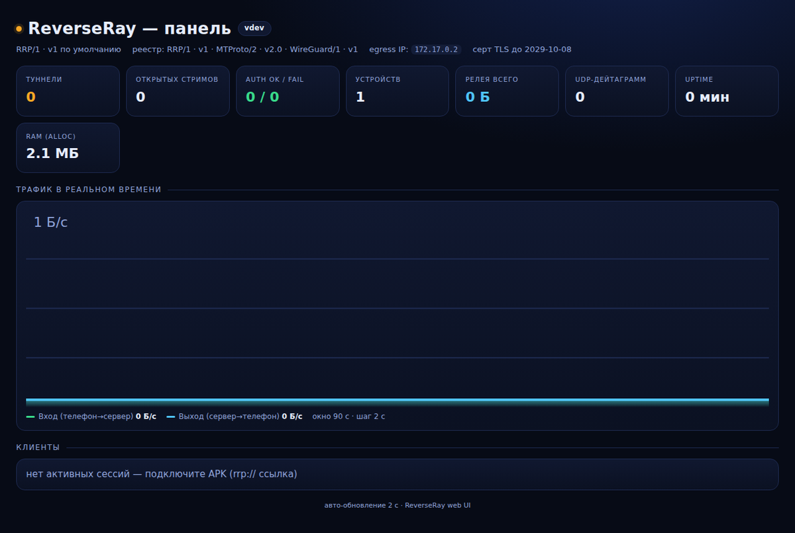
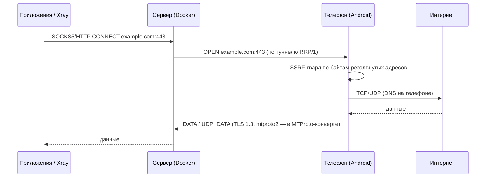

# ReverseRay

> **«Никакой свободы врагам свободы»** — (С) Кровосток

<p align="center">
  <a href="https://github.com/stelgen/reverseray/releases"></a>
  <a href="https://github.com/stelgen/reverseray/actions/workflows/ci.yml"></a>
  <a href="LICENSE"></a>
  
  
  
  
  <a href="https://github.com/stelgen/reverseray/pulls"></a>
</p>

**ReverseRay** — личный прокси-сервер, у которого «выход в интернет» физически
происходит через ваше Android-устройство. Сервер выглядит как обычный
SOCKS5/HTTP-прокси, а целевые сайты видят резидентный IP вашего телефона.
Нат/CGNAT не мешают: туннель инициирует сам телефон. VPS-провайдер с «чистым»
IP не нужен — достаточно любого сервера, где можно запустить Docker.

---

## Миссия

**Создать ультимативное решение для приватного бесплатного хостинга
собственного VPN-подобного прокси** — без покупки VPN-подписок: интернет и
связь уже есть у каждого, и этого достаточно, чтобы поднять свой личный канал
на собственном железе и собственном телефоне.

Проект предназначен **только для легитимного личного использования**. Мы
против скрытного и неправомерного использования приложения в корыстных или
вредоносных целях.

Принципы, из которых не делаем исключений:

| Принцип | Как исполняется |
|---|---|
| **Приватность** | Ни телеметрии, ни внешних хостов вне белого списка; hosts назначения не логируются (redact by default); privacy-audit — CI-гейт каждого PR |
| **Открытость** | «Ничего не прячем»: каждое действие приложения и сервера с сетью и данными видно в консоли/логах/«О сети»/метриках; все механизмы документированы |
| **Полная защищённость** | TLS 1.3 + строгий SPKI-pin (анти-MITM), HMAC-токены, anti-SSRF, WAN-hardening (сканер не получает ни байта), distroless-контейнер без capabilities |
| **Совместимость** | Клиент работает на Android 4.0+ (API 14); сервер — Linux amd64/arm64/armv7 |
| **Безопасность по умолчанию** | Безопасные дефолты везде: автоподключение выключено, inbound без пароля — только в LAN-сценарии владельца, токены хранятся только хэшами |
| **Стабильность** | Экспоненциальный backoff, restart-governor, healthcheck обязателен, фоллбек протоколов, мусорные данные никогда не ломают стек |
| **Бережное отношение к железу** | Дисциплина SSD/RAM: счётчики в RAM, запись на диск раз в минуту; APK не тратит батарею фоновыми пробами; сервер не изнашивает диск хоста |

<p align="center">
  
  
</p>

---

## Как это работает


```mermaid
sequenceDiagram
    participant A as Приложения / Xray
    participant S as Сервер (Docker)
    participant P as Телефон (Android)
    participant N as Интернет

    A->>S: SOCKS5/HTTP CONNECT example.com:443
    S->>P: OPEN example.com:443 (по туннелю RRP/1)
    P->>P: SSRF-гвард по байтам резолвнутых адресов
    P->>N: TCP/UDP (DNS на телефоне)
    N-->>P: данные
    P-->>S: DATA / UDP_DATA (TLS 1.3, mtproto2 — в MTProto-конверте)
    S-->>A: данные
```


```mermaid
flowchart TB
    subgraph WAN["Интернет / WAN"]
        SCAN["nmap · masscan · пробники"] -. "первый байт ≠ TLS — tarpit + тишина (0 байт)" .-> S
        A["Xray / приложения"] -- "SOCKS5/HTTP" --> S
    end
    subgraph TLS["Приватный хендшейк"]
        S["Сервер · hardening gate"] -- "TLS 1.3 + SPKI-pin + HMAC nonce" --> P
        P -- "proto=mtproto2 — DH + MTProto 2.0 конверт" --> P
    end
    P["Телефон · egress + лимит-король"] -- "TCP/UDP (SSRF-guard)" --> N["Сеть телефона"]
    subgraph MODS["Модули (общий манифест)"]
        M["modules.json — GitHub → APK + сервер"]
    end
    M -. "реестр протоколов/политики" .-> S
    M -. "реестр протоколов/политики" .-> P
    classDef server fill:#0b2545,stroke:#35B6FF
    classDef phone fill:#0b3d2e,stroke:#2E7D32
    class S,SCAN server
    class P,MODS phone
```

## Состав проекта

| Компонент | Что это | Где |
|---|---|---|
| Сервер | Go (ноль сторонних зависимостей): SOCKS5/HTTP-инбоксы (TCP+UDP), туннель RRP/1 + WebSocket, mtproto2, WAN-hardening, синхронизатор модулей, метрики, TLS-PKI | [`server/`](server/) |
| Клиент | Kotlin (Android 4.0+): туннель (TCP/WS/mtproto2), модули, «лимит — король», единая консоль, честные вкладки | [`android/`](android/) |
| Манифест модулей | Один `modules.json` для APK и сервера: реестр протоколов, модуль камуфляжа, политики | [`modules/`](modules/README.md) |
| Протокол | Спецификация RRP/1 + UDP + WS + mtproto2 + NOISE | [`docs/protocol.md`](docs/protocol.md) |
| Деплой | Автопилот `rr.sh`: установка/обновление/сброс одной командой | [`deploy/rr.sh`](deploy/rr.sh) |
| CI-роботы | Тесты, приватность, модули, скриншот, секреты | `.github/workflows/` |

## Возможности (v0.9.5)

Только техника — пользовательский интерфейс сознательно не документируется.

| Возможность | Суть |
|---|---|
| **RRP/1** | Мультиплексирование, flow-control (кредит ≤ буферу приёма), лимиты кадров, keep-alive — спецификация в [`docs/protocol.md`](docs/protocol.md) |
| **wireguard (v0.9.5)** | НАСТОЯЩАЯ криптография WireGuard (актуальный канон whitepaper) внутри приватного канала: Noise_IKpsk2-хендшейк (mac1, enc_static, enc_timestamp/TAI64N), транспортные пакеты `[type=4][receiver][counter][ChaCha20-Poly1305]` со sliding-window анти-реплеем 2048; PSK хендшейка = SHA256(token) — привязка к нашему ключу доверия; кросс-языковой KAT Go↔Kotlin байт-в-байт |
| **mtproto2** | После приватного хендшейка ключи перегенерируются DH-обменом по канону MTProto 2.0 (официальный dh_prime Telegram, AES-256-IGE, msg_key SHA-256); кросс-языковой KAT Go↔Kotlin |
| **AUTO-протокол (v0.9.5)** | Ссылка без `proto=` = режим AUTO: клиент запрашивает предпочтительный протокол, сервер согласует по общему реестру вниз до rrp1; явный `proto=` в ссылке всегда приоритетен; мусор никогда не ломает стек |
| **WAN-hardening** | Туннельный порт отвечает только настоящим TLS-клиентам; первый байт не TLS → tarpit + тихое закрытие без единого байта ответа; глобальные и per-IP лимиты параллельности |
| **Модульная система** | APK — тонкий движок; сервер и приложение парсят ОДИН манифест `modules.json`; обновления модулей без переустановки APK (по версии/хешу, мусор не применяется, даунгрейд запрещён); клиент фоллбечится на rrp1, сервер не откатывается никогда (анти-цикл) |
| **API Mask + выбор клиента (v0.9.5)** | Камуфляж: фоновый обмен внутри туннеля выглядит как API бизнес-приложения; ноль внешних хостов; суточный бюджет из манифеста; кадр `0x2A` — выбор устройства персистентен НА СЕРВЕРЕ (переживает офлайн клиента) и учитывается в READY.features будущих сессий |
| **Лимит трафика — король** | Суточный/месячный лимит с датой сброса; исчерпан → РОВНО НОЛЬ байт: туннель умирает, автоподключение умеет ждать дату сброса |
| **Пин CA — один канон** | пин = SHA256(SPKI CA) у обеих сторон; ротация CA = один тап владельца (диалог с фактическим пином, «Принять» обновляет ссылку и реконнектит); молчаливого доверия нет никогда |
| **Диагностика подключения (v0.9.4)** | `auth failed` — токен ссылки устарел: авто-реконнект останавливается честным статусом (ретраи дают IP-локаут и «TLS handshake_failure(40)» вместо причины); в журнале AUTH печатается префикс токена для сверки со строкой из rr.sh/enroll |
| **Веб-панель `/ui` (v0.9.5)** | Read-only дашборд: график трафика реального времени (окно 90 с), карточки клиентов с полной телеметрией сессии (relay-байты/трафик телефона, стримы, RTT, uptime, UDP/DNS-счётчики, статус крипты протокола), выборы камуфляжа клиентов; опрос 2 с, vanilla JS без зависимостей |
| **Docker** | Distroless БЕЗ шелла (restart-governor в самом бинаре), read-only rootfs, `cap_drop: ALL`; healthcheck обязателен (CI поднимает контейнер с родным entrypoint и ждёт healthy) |
## Быстрый старт — одна команда (автопилот)

Из любого каталога: скрипт создаёт подпапку `reverseray/` (compose, state,
.env), скачивает образ, ставит/обновляет, ждёт healthcheck и печатает готовую
строку подключения:

```bash
curl -fsSL https://raw.githubusercontent.com/stelgen/reverseray/main/deploy/rr.sh -o rr.sh
sudo bash rr.sh
```

| Флаг | Действие |
|---|---|
| *(нет)* | установка/обновление до последнего релиза |
| `--tag v0.8.3` | конкретная версия |
| `--reset` | обнулить состояние (токены/CA) и пере-enroll |
| `--no-ui` | закрыть веб-морду в localhost |

Автообновления контейнера **запрещены** — обновление только этой командой
или вручную (канон: владелец решает, что едет на прод).

## Телефон

1. Скачайте `reverseray-<версия>.apk` со страницы
   [Releases](https://github.com/stelgen/reverseray/releases) — или обновите
   в приложении (вкладка «Обновление»).
2. Вкладка «Связь»: вставьте строку подключения — приложение само её
   почистит, покажет зелёное «Ссылка сохранена ✓» и тост. «Очистить» —
   с подтверждением.
3. Вкладка «Главная»: одна круглая кнопка «Старт». Статус, график, пакеты,
   IP/страна/оператор/DNS, спидтест — в карточке; единая консоль ниже.

Проверка прокси:

```bash
curl --proxy socks5h://127.0.0.1:1080 https://ifconfig.me
# ответ — IP телефона
```

## Если не подключается

| Шаг | Что делать |
|---|---|
| 1 | Вкладка «Лог»: весь журнал; кнопки «Копировать весь лог» и «Поделиться» |
| 2 | Порты **4433/tcp** и **1080/tcp+udp** должны быть открыты в файрволе облака |
| 3 | Строгий пин (v0.9.0): пин = SHA256(SPKI CA) у обеих сторон; если CA перегенерировали — APK покажет диалог «Сервер сменил сертификат»: «Принять новый пин» обновит ссылку и реконнектит (анти-MITM: молча не доверяем никогда) |
| 4 | `sudo bash rr.sh --reset` — чистое состояние за минуту |
| 5 | Сканеры в метриках `reverseray_hardening_*` — это нормально: порт молчит по дизайну |
| 6 | `ERROR 1: auth failed` — токен ссылки устарел (сервер переустанавливали или `--reset`): возьмите свежую строку из вывода `rr.sh`/`enroll` и вставьте заново; не долбите сервер — после 5 неудач он лочит IP, и клиент видит «TLS handshake_failure(40)» вместо причины |

## Интеграция с Xray

```json
{
  "protocol": "socks",
  "settings": { "servers": [{ "address": "SERVER_IP", "port": 1080 }] }
}
```

## Безопасность

Кратко: TLS 1.3 + ALPN + SPKI-pin (несовпадение заданного пина = отказ —
анти-MITM; TOFU только при первой дружбе); HMAC с одноразовым nonce;
anti-SSRF на байтах адресов; WAN-hardening (анти-скан с tarpit и нулём
ответных байтов); mtproto2 — канон MTProto 2.0 поверх приватного хендшейка;
admin API — только localhost/unix; контейнер distroless + governor.
Полная модель угроз — [`SECURITY.md`](SECURITY.md), свежий аудит —
[`docs/security-audit-2026-10.md`](docs/security-audit-2026-10.md).

## CI-роботы

| Робот | Что делает |
|---|---|
| `go` | gofmt/vet/test-race/coverage — 147 тестов |
| `android` | сборка + 195 JVM-тестов (Robolectric 21/31, evil-сервер, KAT MTProto, фоллбек, тема, SHA256SUMS, камуфляж, UX-скролл, i18n-гейты) |
| `modules` | канон-чек манифеста (включая секцию camouflage) + парсеры обеих сторон согласны |
| `privacy-audit` | ни телеметрии, ни внешних хостов вне белого списка, ни приватных данных в доках |
| `govulncheck` | известные уязвимости stdlib/зависимостей |
| `gitleaks` | секреты |
| `screenshot-apk` | отдельный воркфлоу после релиза: APK с эмулятора (adb полным путём, boot 4×450 с, гейты /dev/kvm+system-image+AVD) → `assets/brand/screenshot.png` |
| `screenshot-web` | отдельный воркфлоу после релиза: веб-панель /ui из образа релиза (pull×3, healthy 240 с, healthz-ретраи 15×2 с) → `assets/brand/web.png` |
| `assets` | детерминизм брендинга, живой banner.gif |
| `docker` | сборка образа + healthcheck |
| `codeql` | стат-анализ безопасности |
| `dependency-review` | PR-гейт зависимостей |

---

## English

**ReverseRay** turns an Android device into the egress node of a personal
proxy. The server (Docker) exposes a standard SOCKS5/HTTP inbound, but all
traffic physically exits through your phone: the device initiates the TLS 1.3
tunnel itself, so no inbound ports or port forwarding are required. It works
behind NAT/CGNAT and yields a residential IP instead of a datacenter one.

**Mission:** the ultimate self-hosted, free, private personal proxy — no VPN
subscriptions to buy; your existing internet connection is enough. Built for
legitimate personal use only; we do not support covert or malicious use.
Nothing the app or the server does with the network or your data is hidden —
everything is visible in statuses, logs and the About panels.

### Quick start (one command — autopilot)

```bash
curl -fsSL https://raw.githubusercontent.com/stelgen/reverseray/main/deploy/rr.sh -o rr.sh
sudo bash rr.sh
```

Flags: `--tag vX.Y.Z` · `--reset` (wipe tokens/CA and re-enroll) · `--no-ui`.

### Phone

1. Grab `reverseray-<version>.apk` from
   [Releases](https://github.com/stelgen/reverseray/releases) — or update in-app.
2. Paste the connection string — the app auto-fixes it, shows a green
   “Link saved ✓” and a toast.
3. Tap the single round «Start» button — tunnel up (live traffic graph,
   honest network facts, 5s speed test).

Verify:

```bash
curl --proxy socks5h://127.0.0.1:1080 https://ifconfig.me
# returns the phone's IP
```

### Highlights (technical only — UI is intentionally not documented)

| Feature | Summary |
|---|---|
| RRP/1 | multiplexing, flow-control (credit ≤ receive buffer), frame limits, keep-alive — spec in docs/protocol.md |
| wireguard (v0.9.5) | REAL WireGuard crypto (current whitepaper canon) inside the private channel: Noise_IKpsk2 handshake (mac1, TAI64N), transport packets with ChaCha20-Poly1305 and a 2048 sliding-window anti-replay; handshake PSK = SHA256(token); byte-exact Go↔Kotlin KAT |
| mtproto2 | DH key regeneration per Telegram canon (official dh_prime); AES-256-IGE payload envelope; cross-language KAT |
| AUTO protocol (v0.9.5) | link without `proto=` = AUTO: client asks for the preferred protocol, server negotiates down to rrp1; explicit `proto=` always wins |
| WAN hardening | tunnel port speaks only to real TLS clients; scanners get a tarpit and zero response bytes |
| Modules | APK is a thin engine — server and app parse the SAME `modules.json`; updates without reinstall; client falls back to rrp1, server never rolls back |
| API Mask + client choice (v0.9.5) | in-tunnel API-like chatter; frame `0x2A` persists the device choice on the SERVER (survives offline) and gates READY.features of future sessions |
| Traffic limit is king | exhausted → exactly zero bytes; auto-reconnect can wait for the reset date |
| Connection diagnostics (v0.9.4) | server `auth failed` → auto-reconnect stops with a clear status; AUTH log prints the token prefix (6 chars) |
| Web panel `/ui` (v0.9.5) | read-only dashboard: real-time traffic chart, per-client session telemetry (relay/phone bytes, streams, RTT, uptime, UDP/DNS counters, crypto state), 2 s poll, zero JS dependencies |
| Docker | distroless without shell (in-binary restart governor), cap_drop ALL, healthcheck (CI waits for healthy) |
### Compatibility

| Component | Min | Tested |
|---|---|---|
| Server | Linux, Go 1.24+ | amd64 / arm64 / armv7 |
| Client | Android 4.0 (API 14) | Robolectric 21/31, manual smoke 14–20 |

---

<p align="center">
  <a href="SECURITY.md">Security</a> ·
  <a href="docs/protocol.md">Protocol</a> ·
  <a href="modules/README.md">Modules</a> ·
  <a href="docs/WORKFLOW.md">Workflow &amp; policies</a> ·
  <a href="CHANGELOG.md">Changelog</a> ·
  <a href="https://stelgen.github.io/reverseray/">Landing</a>
</p>

## Лицензия и авторство

**BSD 2-Clause** — см. [LICENSE](LICENSE). Владелец авторских прав —
STELGEN, автор идеи и проекта: https://github.com/stelgen/reverseray.

Лицензия **обязывает сохранять указание авторства** в любом редистрибутиве
(копирайт-строка и LICENSE-файл): форки, статьи и сборки должны ссылаться на
автора. Документация/брендинг по желанию — на условиях CC-BY-4.0.
