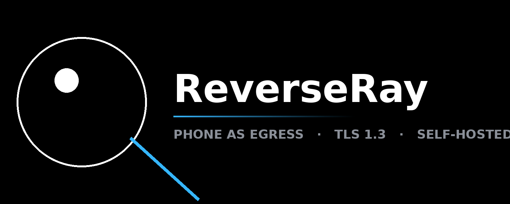
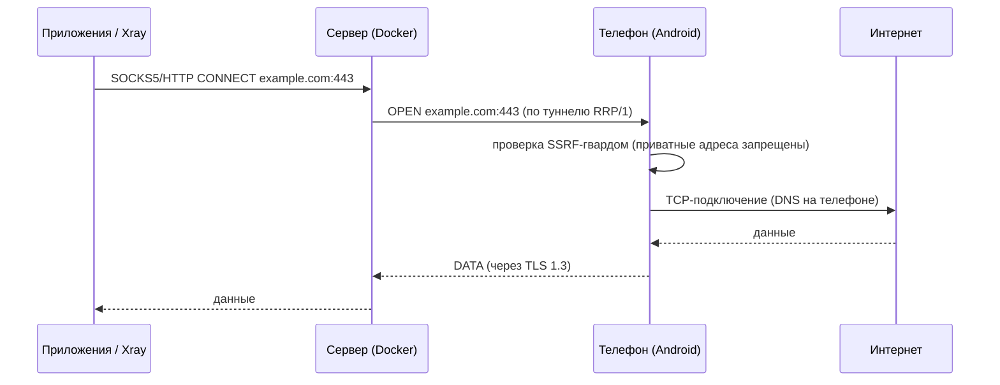
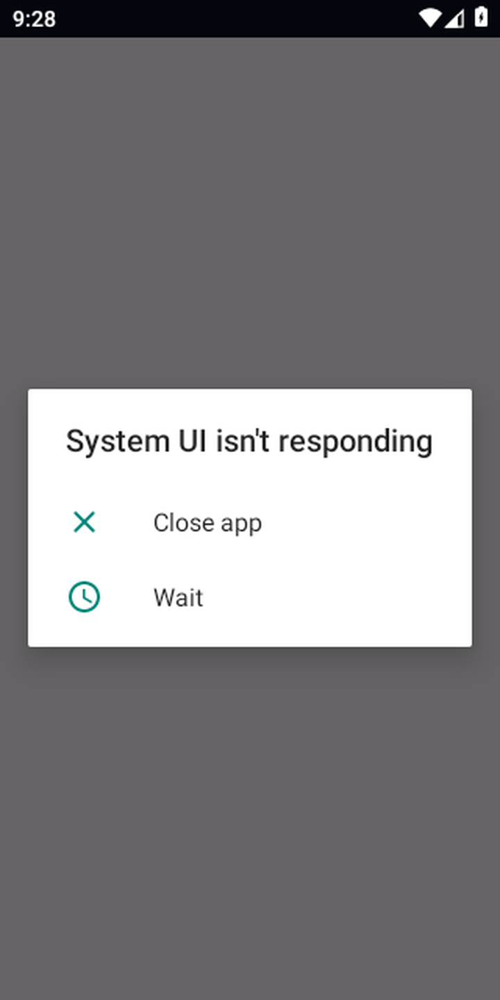

# ReverseRay

<p align="center">
  
</p>

<p align="center">
  <a href="https://github.com/stelgen/reverseray/releases"></a>
  <a href="https://github.com/stelgen/reverseray/actions/workflows/ci.yml"></a>
  <a href="LICENSE"></a>
  
</p>

<p align="center"><b>
  Личный прокси, исходящий трафик которого идёт через ваше Android-устройство.
  Сервер выглядит как обычный SOCKS5/HTTP-прокси, но «выход в интернет» —
  ваш телефон: резидентный IP, NAT/CGNAT не мешают, VPS-провайдер не нужен.
</b></p>

---

## 🇷🇺 Русский

### Что это и зачем

Типовой сценарий: у вас есть сервер в облаке, но нужен **резидентный IP** —
адрес домашней или мобильной сети (для сервисов, отслеживающих датацентровые
адреса). ReverseRay решает это разворотом ролей: сервер принимает подключения,
а интернет-трафик проходит через ваш телефон, который **сам** инициирует
TLS-туннель к серверу. Входящие порты на телефоне не нужны, работает из любой
сети — Wi-Fi, LTE, за CGNAT.


```mermaid
sequenceDiagram
    participant A as Приложения / Xray
    participant S as Сервер (Docker)
    participant P as Телефон (Android)
    participant N as Интернет

    A->>S: SOCKS5/HTTP CONNECT example.com:443
    S->>P: OPEN example.com:443 (по туннелю RRP/1)
    P->>P: проверка SSRF-гвардом (приватные адреса запрещены)
    P->>N: TCP-подключение (DNS на телефоне)
    N-->>P: данные
    P-->>S: DATA (через TLS 1.3)
    S-->>A: данные
```

### Возможности

- **Протокол RRP/1**: мультиплексирование потоков, flow-control, лимиты кадров,
  keep-alive. Спецификация: [`docs/protocol.md`](docs/protocol.md).
- **Сервер** (Go, ноль зависимостей): mixed-инбокс SOCKS5/HTTP на одном порту,
  TLS 1.3 с SPKI-пином на CA, HMAC-токены с одноразовым nonce, admin API,
  метрики Prometheus, авто-подхват токенов.
- **Клиент** (Kotlin, Android 4.0+): foreground-сервис, переподключение с
  экспоненциальной задержкой, мгновенный retry при смене сети, QR-импорт,
  авто-обновление с GitHub Releases, журнал ошибок с копированием.
- **Безопасность**: anti-SSRF на байтах резолвнутых адресов (включая
  TEST-NET), lockout при брутфорсе токена, rate-limit рукопожатий,
  красaction адресов в логах.

<p align="center">
  
</p>

### Быстрый старт

```bash
sudo git clone https://github.com/stelgen/reverseray.git
cd reverseray

sudo mkdir -p state && sudo chown 65532:65532 state
docker compose up -d
sudo docker compose exec reverseray /reverseray enroll -state-dir /var/lib/reverseray -name phone-1
```

`enroll` сам определит внешний IP сервера, сам добавит токен в
`state/tokens.json` и напечатает готовую строку вида:

```
rrp://<token>@81.25.59.194:4433/?pin=<CA_PIN>&name=phone-1
```

Сервер перечитывает токены автоматически (до 3 с). Скачайте `app-release.apk`
со страницы [Releases](https://github.com/stelgen/reverseray/releases),
вставьте строку (или отсканируйте QR) — туннель готов. Проверка:

```bash
curl --proxy socks5h://127.0.0.1:1080 https://ifconfig.me
# ответ — IP телефона
```

### Обновление

```bash
docker compose pull && docker compose up -d
docker compose exec reverseray /reverseray reset-state -state-dir /var/lib/reverseray
docker compose exec reverseray /reverseray enroll -state-dir /var/lib/reverseray -name phone-1
```

`reset-state` сбрасывает токены («чистый лист» при редеплое); приложение
обновится само (кнопка «Проверить обновления») — подставьте новую строку.

### Если не подключается

1. В приложении кнопка «Журнал» — покажет последовательность ошибок, копируется.
2. Порт **4433/tcp** должен быть открыт в файрволе облака.
3. `CA-pin` в строке — из лога сервера (`ca_pin`), не перепутайте.
4. Статус в приложении: 🟡 подключается · 🟢 подключено · 🔴 ошибка.

### Интеграция с Xray

```json
{
  "protocol": "socks",
  "settings": { "servers": [{ "address": "SERVER_IP", "port": 1080 }] }
}
```

### Безопасность

Кратко: TLS 1.3 с обязательным ALPN и SPKI-пином на CA; токены хранятся
только как SHA-256; аутентификация — HMAC с одноразовым nonce; лимиты кадров
(DATA ≤ 64 КБ, управляющие ≤ 4 КБ) и бюджет памяти на устройство; admin API —
только localhost/unix-сокет; контейнер — distroless, non-root, read-only.
Полная модель угроз — [`SECURITY.md`](SECURITY.md), отчёт аудита —
[`docs/security-audit-2026-09.md`](docs/security-audit-2026-09.md).


```mermaid
flowchart LR
    subgraph Trust zones
        W[Интернет] -- TLS 1.3 + SPKI-pin --> S
        S -- "RRP/1 (внутри TLS)" --> P
        P -- "TCP (SSRF-guard)" --> N[Сеть телефона]
    end
    S[Сервер<br/>0 исходящих]:::server
    P[Телефон<br/>egress]:::phone
    classDef server fill:#0b2545,stroke:#35B6FF
    classDef phone fill:#0b3d2e,stroke:#2E7D32
```

### Архитектура

```
server/                    Go-сервер: инбоксы, RRP/1, hub, метрики, TLS-PKI
android/                   Kotlin-клиент: туннель, M3-интерфейс, updater
docs/protocol.md           Спецификация RRP/1
docs/security-audit-…      Отчёт аудита безопасности
deploy/digests.yaml        Digest-пины образов для прод-компоуза
assets/brand/              Брендинг (генератор + тесты)
```

---

## 🇬🇧 English

**ReverseRay** turns an Android device into the egress node of a personal
proxy. The server (Docker) exposes a standard SOCKS5/HTTP inbound, but all
traffic physically exits through your phone: the device **initiates** the
TLS 1.3 tunnel itself, so no inbound ports or port forwarding are required.
It works behind NAT/CGNAT and yields a residential IP instead of a datacenter one.

### Quick start

```bash
sudo git clone https://github.com/stelgen/reverseray.git
cd reverseray
sudo mkdir -p state && sudo chown 65532:65532 state
docker compose up -d
sudo docker compose exec reverseray /reverseray enroll -state-dir /var/lib/reverseray -name phone-1
```

`enroll` auto-detects the server's public IP, registers the device token and
prints a ready-to-use config string. Paste it into the app
(`app-release.apk` from [Releases](https://github.com/stelgen/reverseray/releases))
or scan its QR code. Verify:

```bash
curl --proxy socks5h://127.0.0.1:1080 https://ifconfig.me
# returns the phone's IP
```

### Highlights

- **RRP/1** multiplexed protocol over TLS 1.3 with SPKI CA pinning (see
  [`docs/protocol.md`](docs/protocol.md))
- Go server with **zero dependencies**: mixed SOCKS5/HTTP inbound, HMAC tokens,
  Prometheus metrics, auto token reload
- Android client (API 14+): foreground service, exponential reconnect,
  QR import, in-app updater, copyable error log
- Hostile-environment test suites for both sides (`evilclient_test.go`,
  `EvilServerTest.kt`)

### Compatibility

| Component | Min | Tested |
|---|---|---|
| Server | Linux, Go 1.24+ | amd64 / arm64 / armv7 |
| Client | Android 4.0 (API 14) | Robolectric 21/31, manual smoke 14–20 |

---

<p align="center">
  <a href="SECURITY.md">Security</a> ·
  <a href="docs/protocol.md">Protocol</a> ·
  <a href="CHANGELOG.md">Changelog</a> ·
  <a href="https://stelgen.github.io/reverseray/">Landing</a>
</p>

## Лицензия

MIT — см. [LICENSE](LICENSE).
